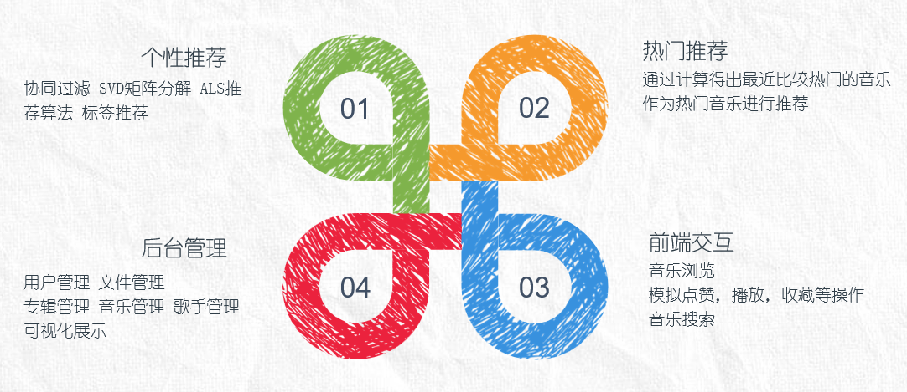
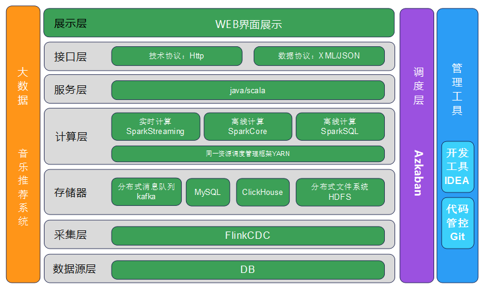
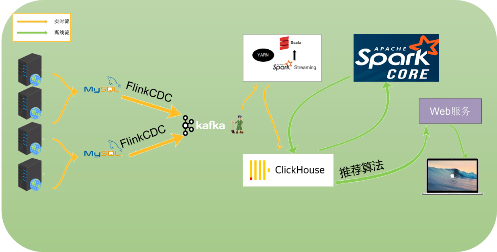
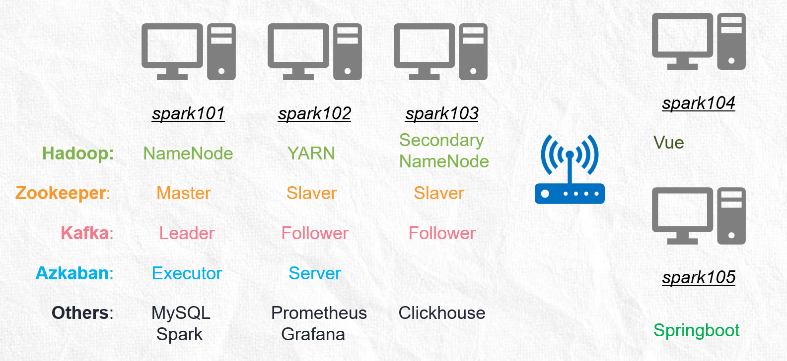

# 基于Spark的分布式音乐推荐系统
本项目是一个基于Spark的分布式音乐推荐系统，旨在通过大数据算法和分布式计算技术，提供高效准确的音乐推荐服务，以满足用户的个性化需求。
## 项目简介
### 业务实现

### 系统架构

### 推荐流程

### 集群部署

详情请查看：https://gitee.com/suwenjiewensu/music-recommendation-system
